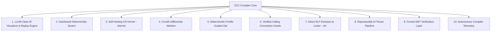

# 🔱 ZCC BATTLE PLAN v1.0.4 — THE AUTONOMOUS SYSTEMS-GRADE TOOLCHAIN ECOSYSTEM

> **Objective:** Transition ZCC from a recursively reproducible, layout-identical, self-hosting systems compiler into an autonomous, distributed, verified toolchain ecosystem capable of direct ELF object emission and bootable kernel target certification.

---

## 🔱 THE TEN EPIC VECTORS



---

### 🔱 1. LLVM-Class IR Visualization & Replay Engine
We transition ZCC’s optimization pipelines from basic diagnostic streams into a serialize-and-replay time-travel framework:
* **Command Interface**:
  - `zcc --emit-ir-graph <file.c> -o <graph.json>`: Outputs SSA dependency graphs, dominance frontiers, and block control-flow topologies.
  - `zcc --replay-ir <graph.json> -o <out.s>`: Bypasses the AST parsing layer entirely, reading the serialized CFG back into the compiler, re-running the optimization pass pipeline, and emitting bitwise-identical target code.
  - `zcc --diff-ir <graph_a.json> <graph_b.json>`: Evaluates compiler passes at the intermediate representation level, producing structural topology delta maps.
* **Impact**: Proves optimization equivalence over refactoring, enables time-travel bisects, and establishes regression testing at absolute IR granularity.

---

### 🔱 2. Distributed Deterministic Build Swarm
We scale ZCC’s local entropy resistance to global, machine-independent determinism across heterogeneous operating systems, processor architectures, and kernels:
* **Target Nodes**: WSL, bare-metal Ubuntu (x86_64), ARM64 Linux, Docker Alpine containers, and remote cloud VMs.
* **Testing Pipeline**:
  ```text
  Compile identical C source with ZCC on all Nodes ──> Compare output hashes (SHA256)
  ```
* **Success Criteria**: 100% hash convergence across all target architectures, verifying that ASLR, memory page sizes, OS scheduling, and environment variable topologies have zero influence on code-generation or optimization paths.

---

### 🔱 3. Self-Hosting Operating System Kernel (`zkernel`)
The canonical rite of passage to a true systems compiler. We define the blueprint for `zkernel`—a bootable unikernel/microkernel built entirely by ZCC:
* **System Capabilities**:
  - Multiboot v1/v2 header compliance for GRUB/QEMU bootloaders.
  - Minimal x86_64 page table initialization and physical memory allocation maps.
  - Basic interrupt vector tables (IDT), PIT timer scheduler, and serial port console logging.
* **Deterministic Verification Gate**:
  - Compiling `zkernel` via Stage-2 and Stage-3 compiler stages produces bitwise-identical bootable images:
    ```bash
    sha256sum stage2_zkernel.bin stage3_zkernel.bin
    ```

---

### 🔱 4. Full Csmith Differential Warfare
We deploy randomized test program fuzzing engines directly against ZCC to expose obscure optimization edge-cases, undefined behaviors (UB), and structural fractures:
* **Harness**:
  - Generate millions of random C programs via `Csmith` or `YARPGen`.
  - Compile sequentially with `zcc`, `gcc -O0`, `gcc -O3`, and `clang`.
  - Execute all produced binaries and monitor output parity.
* **Auto-Reduction**: Integrates `creduce` to automatically isolate failing code paths down to minimal reproducible statements.

---

### 🔱 5. Deterministic PGO (Profile-Guided Optimization)
Profile-Guided Optimization is typically highly vulnerable to compilation timing non-determinism, branch counter overflows, and profiling file write ordering.
* **ZCC Invariant**:
  - Profile generation runs must record deterministic iteration indices and execution traces.
  - Feed-forward optimization matching must be mathematically stable against instruction order fluctuations, ensuring that PGO builds of large codebases remain byte-identical across separate compilations.

---

### 🔱 6. Verified Calling Convention Oracle
We introduce machine-verifiable calling convention tracking for complex FFI boundaries:
* **Command Interface**:
  - `zcc --trace-abi <file.c>`: Emits register classification traces, stack space allocations, hidden `sret` displacement calculations, and floating-point lane assignments.
* **Parity checks**: Automatically verifies emitted x86-64 argument lowering against strict SystemV AMD64 ABI specifications and GCC compilation mappings.

---

### 🔱 7. Deterministic Linker & Object Format Stack (`zld`)
We remove the remaining dependencies on external GNU assemblers (`as`) and linkers (`ld`):
* **Goal**: ZCC directly outputs fully formed ELF-64 relocatable object files (`.o`) and executables.
* **Component Architecture**:
  - Direct machine code generation from Phase 4 without emitting `.s` source files.
  - Direct ELF section emission (symbol tables, string tables, relocation sections).
  - `zld` (ZCC Linker): A deterministic static linker implementing ELF linkage, incremental address space resolution, and DWARF debug section emission.

---

### 🔱 8. Reproducible AI Artifact Pipeline
Integrating compiler-level determinism with neural network serialization:
* **GGUF Emission**: Compiles tensor loading, weight packing, and quantizing layers under strict layout-preservation constraints.
* **Attestations**: Cryptographically signs serialized model weights and quantization tables inside the ELF container, ensuring absolute model provenance and exact weight replication at multi-gigabyte scale.

---

### 🔱 9. Formal Verification Layer
Proving optimization correctness mathematically:
* **SMT Mapping**: Automatically translates AST transformations and peephole rewrite iterations into Z3 SMT-Lib formulas.
* **Formal Proof**: Verifies that compiler-driven instruction substitutions (e.g. register pushes/pops elimination or strength reductions) are formally semantics-preserving.

---

### 🔱 10. Autonomous Compiler Telemetry Constellation
A complete real-time diagnostics visualization subsystem:
* **Emitted Artifacts**:
  - Interactive CFG heatmaps showing hot/cold branch paths.
  - Flamegraphs showing pass-time profiles.
  - Dynamic register allocation pressure timelines.
* **Outcome**: A premium internal inspector platform providing instant optimization transparency.

---

## 🔱 CORE ROADMAP & MILESTONES

| Milestone | Target | Focus Vector | Invariant |
|-----------|--------|--------------|-----------|
| **Milestone 1** | `zkernel` Multiboot | Vector 3 (Kernel Boot) | GRUB/QEMU bootable, Stage 2 == Stage 3 identical |
| **Milestone 2** | `zld` ELF Emission | Vector 7 (Direct Linker) | Direct `.o` object generation without `as` |
| **Milestone 3** | IR Replay Engine | Vector 1 (IR Archeology) | `replay-ir(serialize-ir(x)) == x` assembly |
| **Milestone 4** | Csmith Hardening | Vector 4 (Fuzzing Warfare) | 1,000,000 runs with zero undetected divergences |

---

*🔱 ZKAEDI COMPILER FORGE — v1.0.4 Ecosystem Battle Plan*
*An autonomous, deterministic, and kernel-capable future.*
