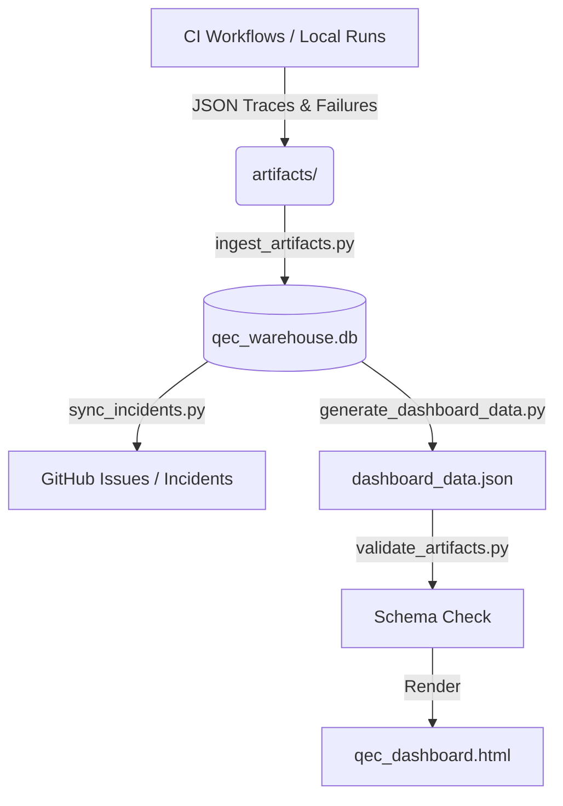

# QEC-VOP Control Plane & Dashboard Runbook

**QEC-VOP: deterministic verification control plane**

---

## 🏗️ Architectural Dataflow



---

## 💻 Local Execution Commands

To execute and preview the control plane locally, run the following sequence:

```bash
# 1. Execute fast verification checks
make qec-max-fast

# 2. Run deterministic fuzz matrix
make qec-max-determinism

# 3. Synchronize open incidents from issue tracker (tokenless dry-run fallback)
python3 scripts/sync_incidents.py --dry-run

# 4. Score local risk for a modified file branch
python3 scripts/score_pr_risk.py --changed-files src/zqec.h --pr-number 123 --commit-sha TESTSHA

# 5. Ingest all artifacts into DB warehouse
python3 scripts/ingest_artifacts.py

# 6. Compile dashboard records and run validation
python3 scripts/generate_dashboard_data.py
```

---

## 📊 Outputs & Artifacts

- **Database Store**: `artifacts/qec_warehouse.db` (SQLite relational structure).
- **Aggregated Index**: `artifacts/dashboard_data.json` (Attestation schema matching).
- **Control Interface**: `tools/qec_dashboard.html` (Local browser view).
