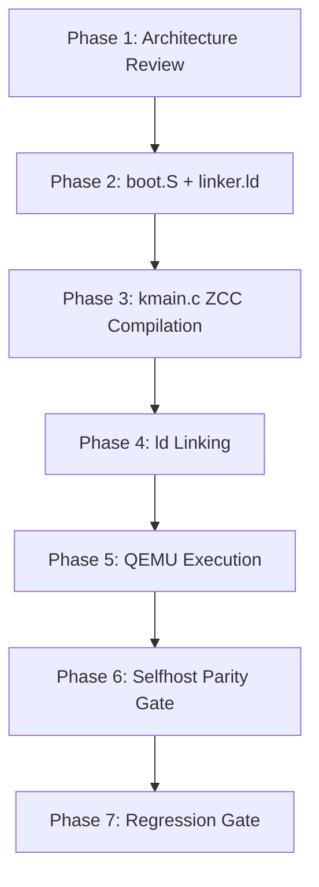

# zkernel v1 Implementation & Verification Plan

This document maps out the specific files and gates required to implement the minimal x86_64 Multiboot2 `zkernel v1`.

---

## 🔱 File Manifest

All files must reside under `kernel/`:

1.  **`kernel/boot.S`**:
    - Implements the Multiboot2 header aligned to 8-byte boundary.
    - Sets up temporary GDT, page tables, and transitions processor from 32-bit protected mode into 64-bit long mode.
    - Resolves stack and jumps directly to `kmain` C entry point.
2.  **`kernel/kmain.c`**:
    - C89-compliant kernel entry point.
    - Implements port I/O helpers `outb` and `inb`.
    - Initializes COM1 serial port and writes `"ZKAEDI\n"`.
3.  **`kernel/linker.ld`**:
    - Links sections starting at `1MB` physical memory offset.
    - Ensures `.multiboot` resides exactly at section start.
4.  **`kernel/Makefile`**:
    - Surgical compilation rules utilizing ZCC for `kmain.c` and standard GCC for `boot.S`.
    - Standard test target executing QEMU with serial output capture.

---

## 🔱 Execution Sequence



---

## 🔱 Hardware I/O Port Helper Design

To bypass libc and write to the ISA bus serial controller, `kernel/kmain.c` implements inline assembly wrappers:

```c
static void outb(unsigned short port, unsigned char val) {
    __asm__ __volatile__("outb %0, %1" : : "a"(val), "Nd"(port));
}

static unsigned char inb(unsigned short port) {
    unsigned char ret;
    __asm__ __volatile__("inb %1, %0" : "=a"(ret) : "Nd"(port));
    return ret;
}
```

---

## 🔱 Phase 2 through Phase 7 Gates

Refer to `kernel/task.md` for specific command invocations and verification gates.
All gates must be run in sequence under WSL distro.
No files outside `kernel/` will be modified or touched in any way.
